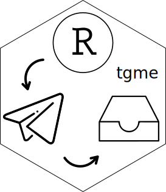

<!-- README.md is generated from README.Rmd. Please edit that file -->

# tgme 

<!-- badges: start -->
<!-- badges: end -->

This is a very simple package with only one function `tgme`. The aim of
this package is to send you a message when a job on Rstudio server is
done (or on your local machine). It is a free alternative to the Rich
Pauloo’s [{textme}](https://github.com/richpauloo/textme) package.

Many thanks to Luca Braglia for the
[{telegram}](https://github.com/lbraglia/telegram), which this package
relies entirely upon.


## Installation

You can install the released version of tgme from
[CRAN](https://CRAN.R-project.org) with:

``` r
install.packages("tgme")
```

And the development version from [GitHub](https://github.com/) with:

``` r
# install.packages("devtools")
devtools::install_github("atsyplenkov/tgme")
```

## Example

This is a basic example which shows you how to solve a common problem:

``` r
library(tgme)
## basic example code
tgme("This is your text")
```

## Set Up

### I. Telegram

1.  Install Telegram
2.  Find and start [`BotFather`](https://telegram.me/botfather)
3.  Type `/newbot` and follow the instructions.
4.  You need to remember and keep your: **`bot_name`** (it’s the first
    question you’ve answered to the botfather) and **TOKEN** to access
    the HTTP API. The **TOKEN** will look smth like `123123:asdasdasd`.
5.  Then you need to get your **`chat_id`**, i.e. your personal user ID.

-   Write something to your bot. For example “Test”.
-   Then, go to your browser and go to
    `https://api.telegram.org/bot**TOKEN**/getUpdates`. Replace word
    TOKEN with your actual token number. For example if your’s token is
    `1234FF`, then you should go to
    `https://api.telegram.org/bot1234FF/getUpdates`
-   In your browser you will see following lines (depending on how many
    messages did you send). Sometimes you should write twice to your
    bot.
    `{"ok":true,"result":[{"update_id":1234, "message":{"message_id":3,"from":{**"id":1234**,"is_bot":false,"first_name":"Name","last_name":"Surname","username":"username","language_code":"en"},"chat":{"id":1234,"first_name":"Name","last_name":"Surname","username":"username","type":"private"},"date":124,"text":"Test"}}`
-   The `"id"` variable is what we are looking for. Therefore **1234**
    is your **`chat_id`**.

### II. R

1.  Install [{telegram}](https://github.com/lbraglia/telegram) package.
2.  Run `usethis::edit_r_environ()` to update your `.Renviron`.
3.  Add line with your telegram **bot\_name** and TOKEN:
    `R_TELEGRAM_BOT_bot_name=123123:asdasdasd` For example if your Bot’s
    name is `ExampleBot` and your token is `1234FF`, then you need to
    add `R_TELEGRAM_BOT_ExampleBot=1234FF` to your `.Renviron`.
4.  Add line with your telegram **`user_name`** and **chat\_id**:
    `R_TELEGRAM_USER_user_name=chat_id` For example if your
    **`user_name`** is `me` and your **chat\_id** is `1234`, then you
    need to add `R_TELEGRAM_USER_me=1234` to your `.Renviron`.
5.  Restart `R` session for changes to take effect

### III. Enjoy

Now you can send yourself a message for free, when the R job is done.
Try:

``` r
library(tgme)
library(tictoc)

tic()
Sys.sleep(5)
fin <- toc()
#> 5.11 sec elapsed


tgme(text = paste0("Job is done for ",
                   round(fin$toc-fin$tic),
                   " sec"),
     bot_name = "rstudio_server",
     user_name = "me")
```


If something is not clear, then read the
[{telegram}](https://github.com/lbraglia/telegram) readme for details.
